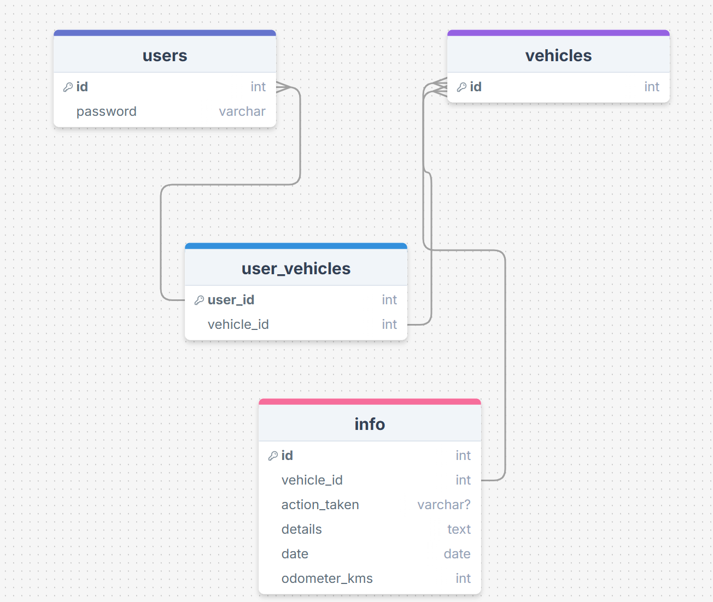

# Sprint 1 - A Working UI Prototype

## Sprint Goals

Develop a prototype that simulates the key functionality of the system, then test and refine it so that it can serve as the model for the next phase of development in Sprint 2.

[Figma](https://www.figma.com/design/3xvhbf0oNIssvHvngZwedf/300dtd-demo-to-do-list?node-id=0-1&p=f&t=gwqM7lWv4cwaPTXF-0) is  used to develop the prototype.

---

## Initial Database Design
4 tables users, vehicles, user_vehicles, and info. all four of them are used to store infomation mainly about what vehicles users own, what has been done serivce wise to the vehicles and keeping the data of the users that have an account for a swift re login when re visitng the website agian.

 
### Required Data Input
one of the main required data inputs that will be needed for my maintenance tracker will be the what has been done to the vehicle (service wise). this speific piece of data will be very important because without it the user anda admin of the website wont know what has been done to the vehicle. also without this data it would be impossible to know when to do the same service again because the user wont know what had been done.
### Required Data Output
the types of data that will be displayed is text, as it will display what has happened to the vehicle (service wise). it will be displayed on the mainteance tracker section of my website that will show the allocated user what has happened to their car.
### Required Data Processing
Replace this text with a description of how the data will be processed to achieve the desired output(s) - any processes / formulae?
the data will be processed quite simply. this tracker will rely on the user to input what has happened to their vehicle (service wise). once this has happened successfully the data will be processed throughout the database and then stored into the list of servicing that has happened to the speific users vehicle. this is simple and effective. 

---

## UI 'Flow'

The first stage of prototyping was to explore how the UI might 'flow' between states, based on the required functionality.

This Figma demo shows the initial design for the UI 'flow':

<iframe style="border: 1px solid rgba(0, 0, 0, 0.1);" width="800" height="450" src="https://embed.figma.com/design/3xvhbf0oNIssvHvngZwedf/300dtd-demo-to-do-list?node-id=0-1&embed-host=share" allowfullscreen></iframe>
### Testing

I tested the UI flow my creating it and then going into the point of view of a phone and computer screen and seeing what it would look like visually for the user when they are moving throughout my website. I also made sure that all of the buttons worked so the users could efficiently maneuver throughout the website.
### Changes / Improvements
I though after testing that there needed to be more infomation around all of the features like the text boxes. so above them i made sure to write a short descripiton of what is meant to be written there to assist the user in doing things such as logging in to the website.

<iframe style="border: 1px solid rgba(0, 0, 0, 0.1);" width="800" height="450" src="https://embed.figma.com/design/3xvhbf0oNIssvHvngZwedf/300dtd-demo-to-do-list?node-id=0-1&embed-host=share" allowfullscreen></iframe>

---

## Initial UI Prototype

The next stage of prototyping was to develop the layout for each screen of the UI.

This Figma demo shows the initial layout design for the UI:

<iframe style="border: 1px solid rgba(0, 0, 0, 0.1);" width="800" height="450" src="https://embed.figma.com/design/3xvhbf0oNIssvHvngZwedf/300dtd-demo-to-do-list?node-id=0-1&embed-host=share" allowfullscreen></iframe>

### Testing
when i was testing the UI and flow i asked my end users what they thought about the current UI Prototype and what could be improved overall. They said things like the colour of the buttons, labeling them more clearly and to use dummy data in the boxes so the users can get a better understanding of what is meant to be in the boxes.
### Changes / Improvements

Replace this text with notes any improvements you made as a result of the testing.
as a result of this testing i made some signficant improvements over the other version of my figma demo. i added dummy data so that the users can understand what is needed to be placed in the text boxes. i coloured the buttons so that it makes sense what it does, red = bad, green = good. and finally i labeled all of the querys more clearly so that users would understand what is needed to be typed.  
  
<iframe style="border: 1px solid rgba(0, 0, 0, 0.1);" width="800" height="450" src="https://embed.figma.com/design/3xvhbf0oNIssvHvngZwedf/300dtd-demo-to-do-list?node-id=0-1&embed-host=share" allowfullscreen></iframe>

---

## Refined UI Prototype

Having established the layout of the UI screens, the prototype was refined visually, in terms of colour, fonts, etc.

This Figma demo shows the UI with refinements applied:

*FIGMA REFINED PROTOTYPE - PLACE THE FIGMA EMBED CODE HERE - MAKE SURE IT IS SET SO THAT EVERYONE CAN ACCESS IT*

### Testing

Replace this text with notes about what you did to test the UI flow and the outcome of the testing.

### Changes / Improvements

Replace this text with notes any improvements you made as a result of the testing.

*FIGMA IMPROVED REFINED PROTOTYPE - PLACE THE FIGMA EMBED CODE HERE - MAKE SURE IT IS SET SO THAT EVERYONE CAN ACCESS IT*

---

## Sprint Review

Replace this text with a statement about how the sprint has moved the project forward - key success point, any things that didn't go so well, etc.

