# Sprint 2 - A Minimum Viable Product (MVP)

## Sprint Goals

Develop a bare-bones, working web application that provides the key functionality of the system, then test and refine it so that it can serve as the basis for the final phase of development in Sprint 3.

---

## Implemented Database Schema
this is the DB schema that i have been using for the assessment, covering all of my data that i use for my website.

---

## Initial Implementation

The key functionality of the web app was implemented:

**PLACE SCREENSHOTS AND/OR ANIMATED GIFS OF THE SYSTEM HERE**
home page:
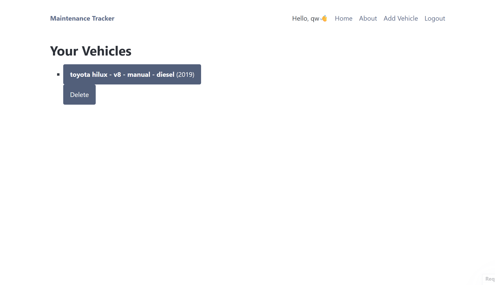,
log add and view page:
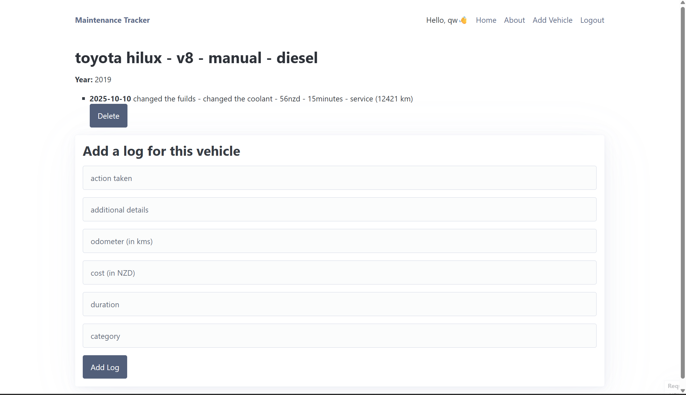, 
about page:
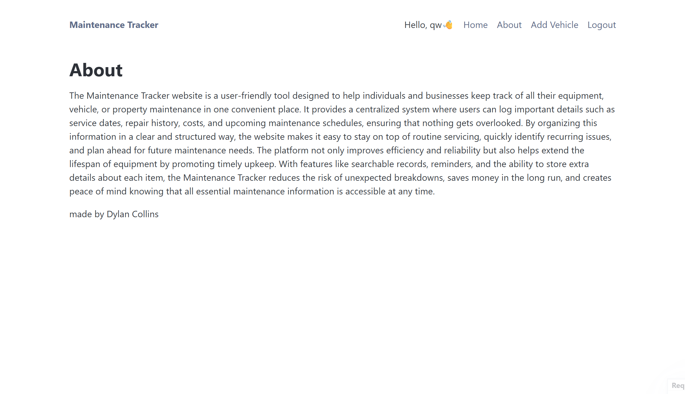
add vehicle page:
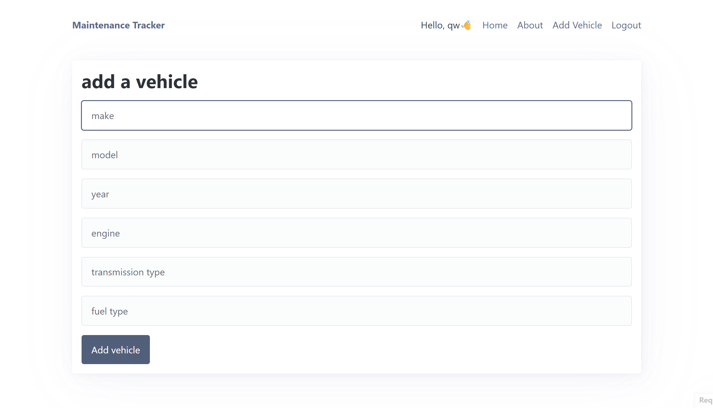, 
login page:
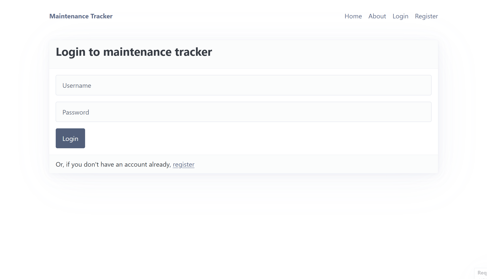, 
registration page:
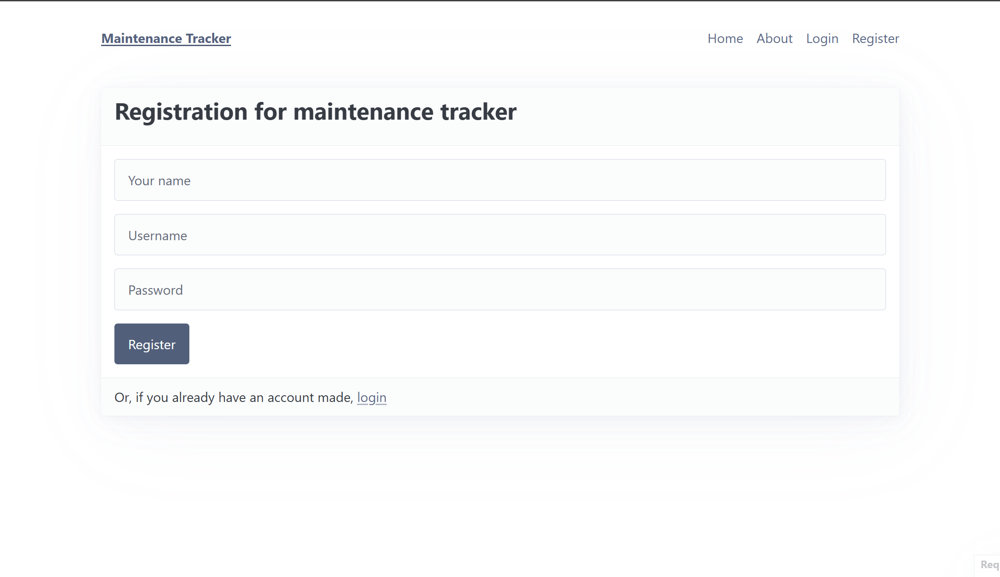, 

---

## Testing displaying user vehicles 
when users add vehicles they are displayed on the home screen and shown to them.

**PLACE SCREENSHOTS AND/OR ANIMATED GIFS OF THE TESTING HERE**

### Changes / Improvements

i tested the display of the text to make sure it was shwoing the right text and added a system so that they can add logs to vehicles they have available to them.
**PLACE SCREENSHOTS AND/OR ANIMATED GIFS OF THE IMPROVED SYSTEM HERE**

now users can see there current vehicles in a button format
---

## displaying of logs/deletion

i was testing the displaying of logs and the addding of them, making it look presentable, and wanting to add the ability to delete logs 
**PLACE SCREENSHOTS AND/OR ANIMATED GIFS OF THE TESTING HERE**

### Changes / Improvements

made the user be able to delete logs for their current vehicle that they own 
**PLACE SCREENSHOTS AND/OR ANIMATED GIFS OF THE IMPROVED SYSTEM HERE**
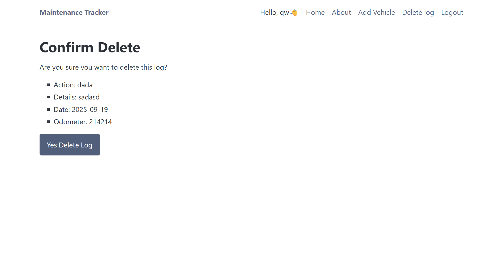

---

## Testing deletion of vehicles 

i am testing the ability of users on the mainteance tracker website to be able to delete vehicles from thier fleet if they own it 
**PLACE SCREENSHOTS AND/OR ANIMATED GIFS OF THE TESTING HERE**
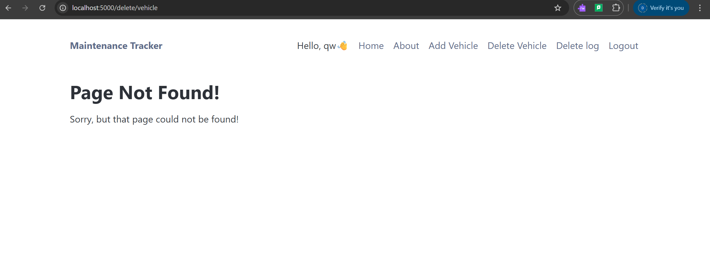
### Changes / Improvements

i made it able for someone to be able to delete their vehicle considering that they are the owner of the vehicle and they are logged in to the website
**PLACE SCREENSHOTS AND/OR ANIMATED GIFS OF THE IMPROVED SYSTEM HERE**
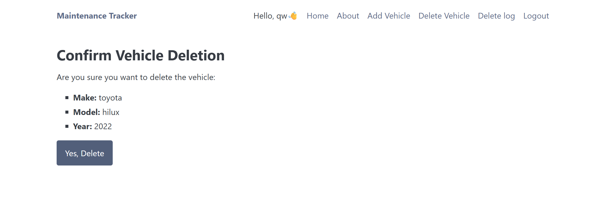

---

## adding vehicles 

i am testing the users ability to add vehicles to thier fleet when they are logged in, and to display them at the home screen if the vehicles are theirs.
**PLACE SCREENSHOTS AND/OR ANIMATED GIFS OF THE TESTING HERE**
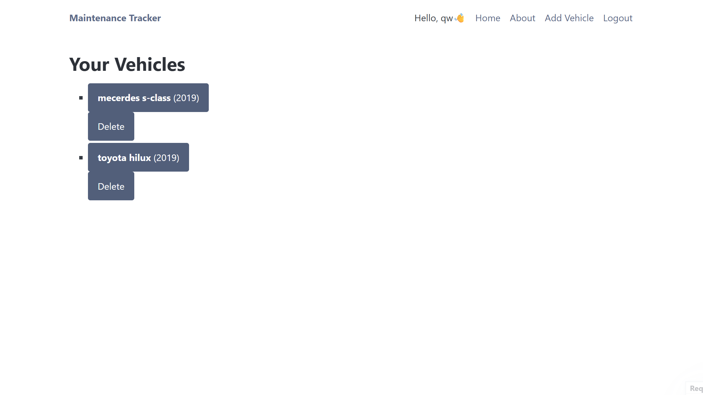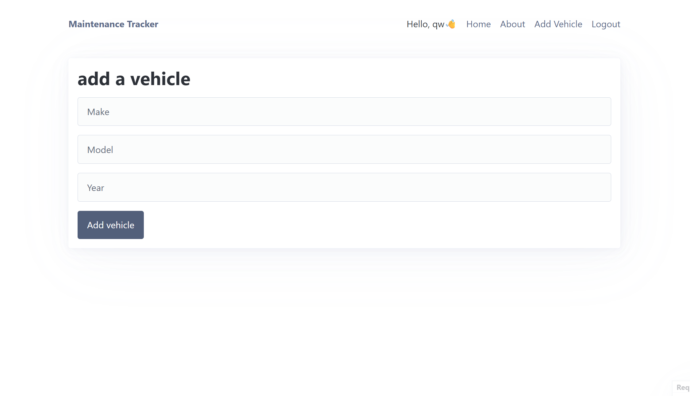
### Changes / Improvements

made the user able to delete the vehicles, also adding bullet points next to the button dispalying the current vehicles the user owns. To improve the overall look of the website when people are scrolling throughout.
**PLACE SCREENSHOTS AND/OR ANIMATED GIFS OF THE IMPROVED SYSTEM HERE**

---

## Testing login and registration

i am testing if the login and registration of the website is working how it needs to and doing things such as changing the header of the page to my speific website so the user knows that they are in the right place
**PLACE SCREENSHOTS AND/OR ANIMATED GIFS OF THE TESTING HERE**

### Changes / Improvements
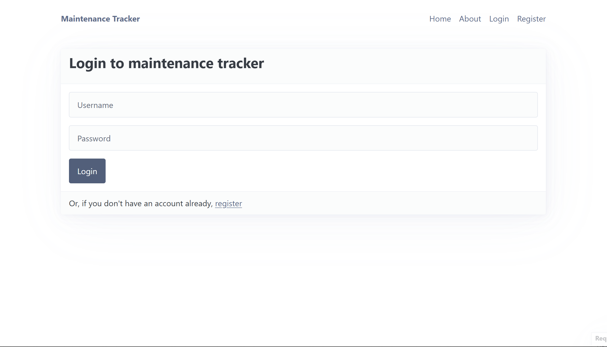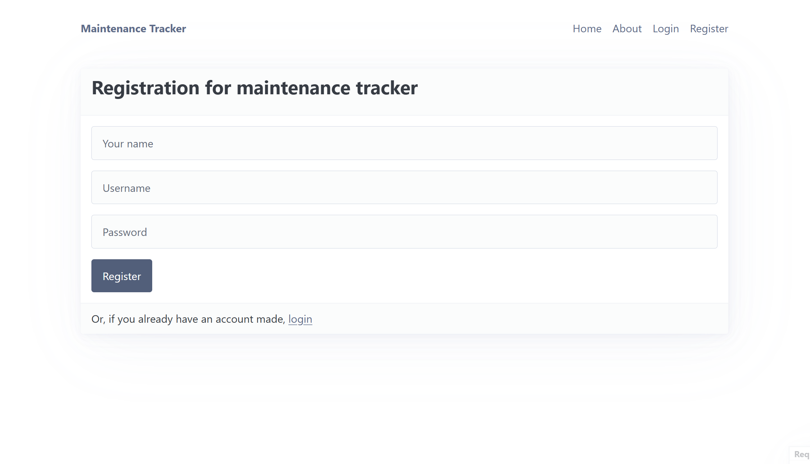

i changed the header (h1) of both the registration and login page to incorparte my name of the website "maintenance tracker" this will allow users to know that they are in the right place when they are attemtping to register or login in to the website to track there maintenance.
**PLACE SCREENSHOTS AND/OR ANIMATED GIFS OF THE IMPROVED SYSTEM HERE**

---

## Sprint Review
this spirnt has helped signficnatly with the development of my website as i have been able to create the main features of the website that need to be made to make it usable for users. some of the key success points of this sprint would be getting the deletion of vehicles and logs working. this part took the longest for me becuase i was having issues with getting the log id and vehicle id, eventually i figuired it out and this feature of deletion made the website alot better. after this success i also added some more data such as engine, transmission, duration, catergory and a few more. some things that didnt go well was probably the time it took to get the deletion of vehicles and logs working. it took a lot longer than it needed to and i could of used that time more effectively and improving my website further.

