# Sprint 3 - A Refined and Complete System

## Sprint Goals

Develop the system until it is fully featured, with a refined UI and it satisfies the requirements. The system will be fully tested at this point.

---

## Updated Database Schema (if it changed)

the DB schema has changed quite a bit considering the image shown below, i have added other data such as, engine, transmission, duration, service type and many others. signficant changes have been made to the database schema

---

## Final Implementation

The web app is fully implemented with a refined UI:

**PLACE SCREENSHOTS AND/OR ANIMATED GIFS OF THE SYSTEM HERE**
home page:
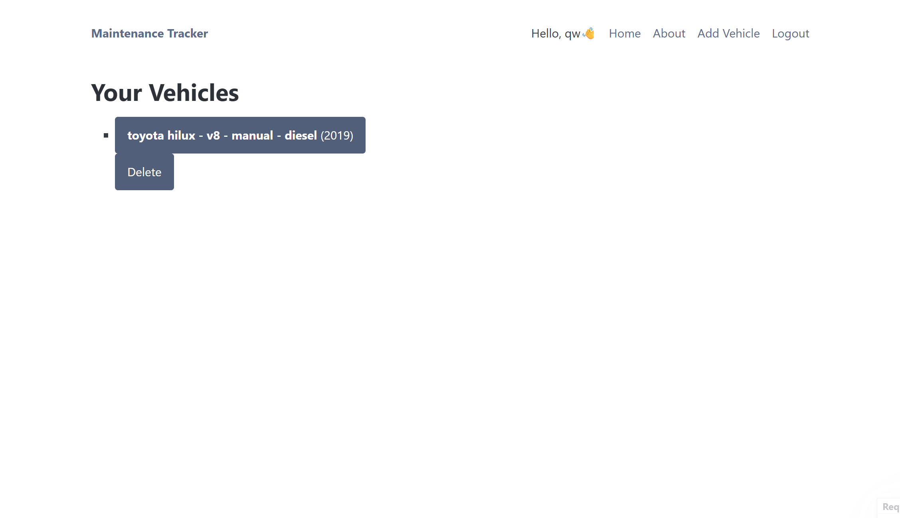,
log add and view page:
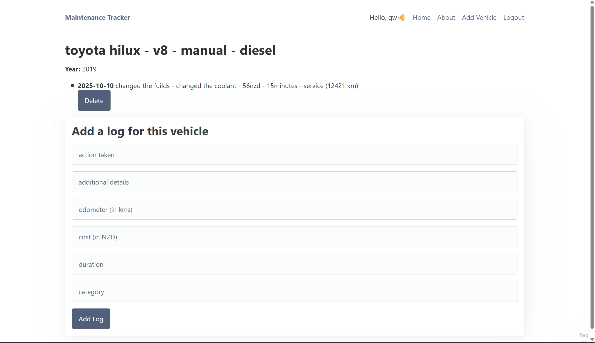, 
about page:
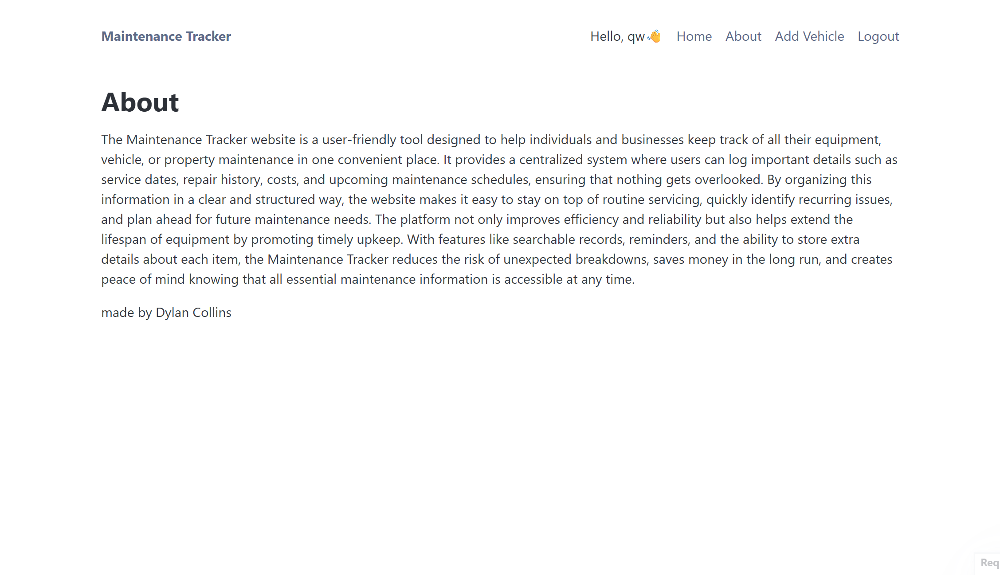
add vehicle page:
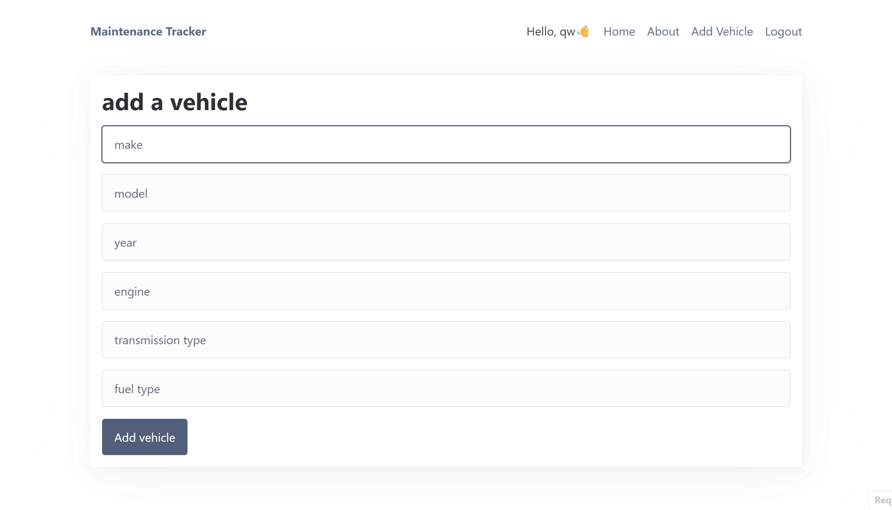, 
login page:
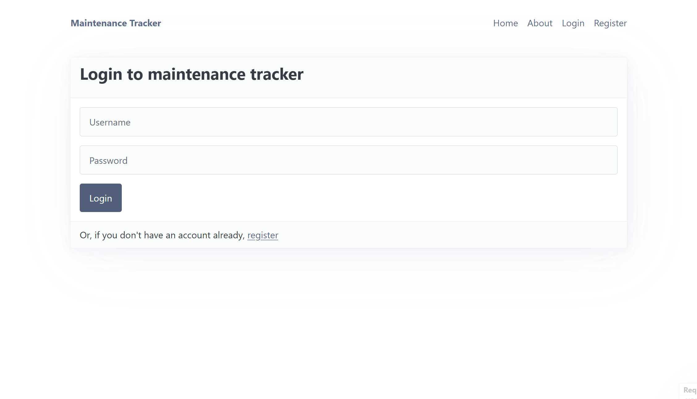, 
registration page:
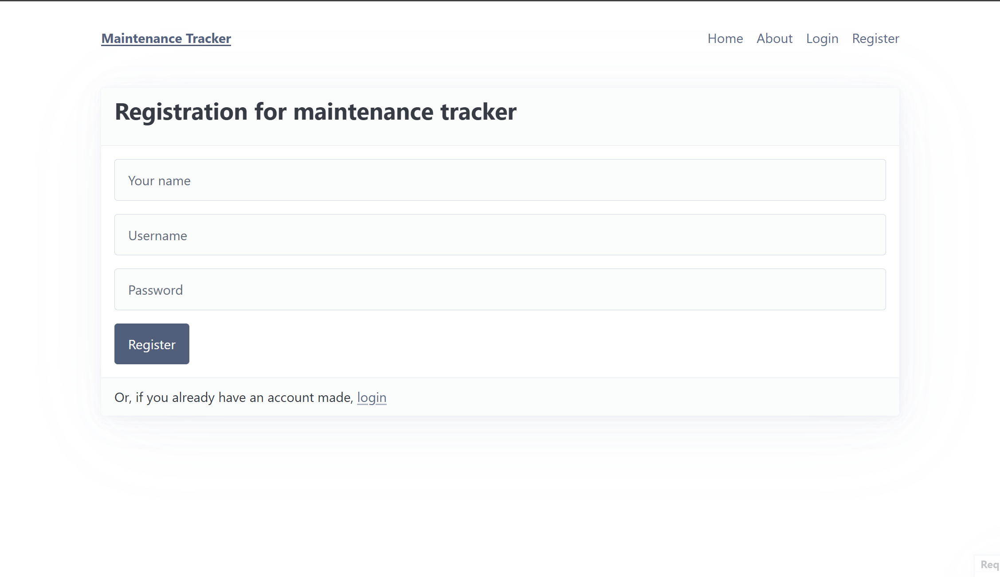, 

---

## light and dark mode

when i was testing the website for core functions that make the website useable and appeling to the user i though about the addition of a dark mode, this would allow the user to switch between dark and light mode whenever they want. this would improve the user experience but allowing the user to change the brightness of the website via light and dark mode
**PLACE SCREENSHOTS AND/OR ANIMATED GIFS OF THE TESTING HERE**
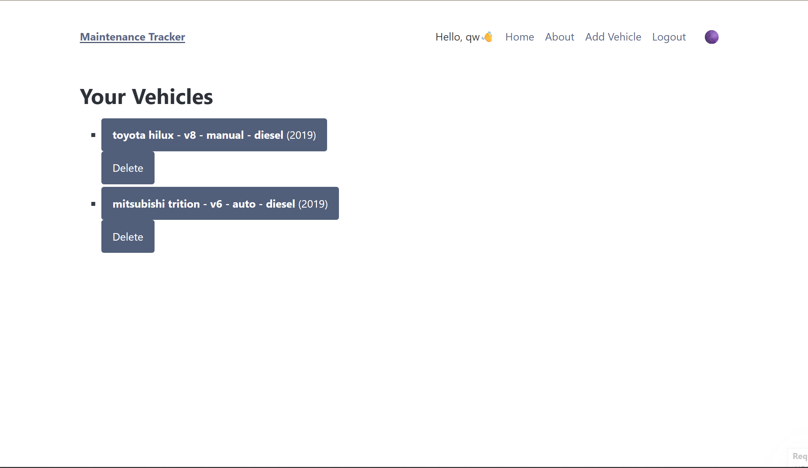 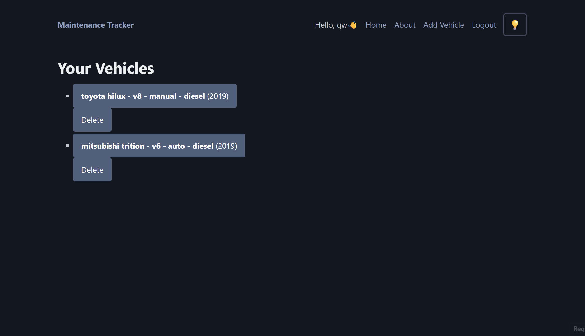
### Changes / Improvements
the screenshots above was the icon being inplemeted but it wouldnt allow me to change through the dark and light mode i would have to reload the website, now with the improvements and changes i have made it now allows the user to change between light and dark mode without having to reload the wesbite, which allows for a overall better user experience. 
**PLACE SCREENSHOTS AND/OR ANIMATED GIFS OF THE IMPROVED SYSTEM HERE**
<video controls src="Vehicle List - Google Chrome 2025-10-21 09-54-31.mp4" title="Title"></video>

---

## emojis for different titles
when my end users were giving me feedback on what could improve the user experience of the website they said that i could add emojis around some of the titles of the website i currently have, for example the vehicle description and log descriptions.
**PLACE SCREENSHOTS AND/OR ANIMATED GIFS OF THE TESTING HERE**
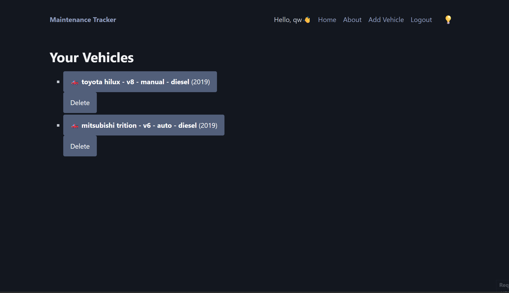 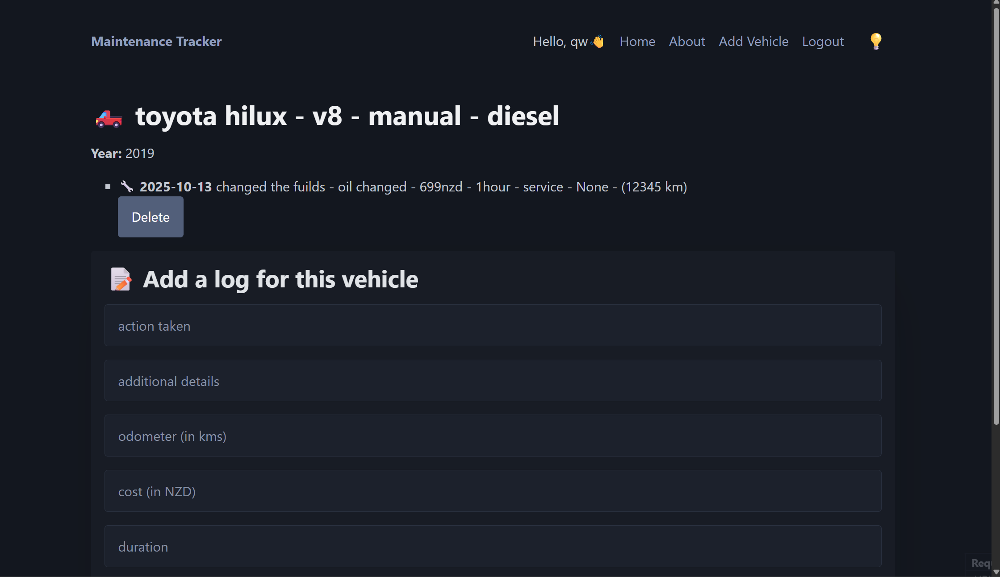

### Changes / Improvements

I added some more across more of the pages to further inprove the ability of the user scanning throughout the website to identify areas throughout the website where it could be harder made easier with the addition of these emojis.
**PLACE SCREENSHOTS AND/OR ANIMATED GIFS OF THE IMPROVED SYSTEM HERE**
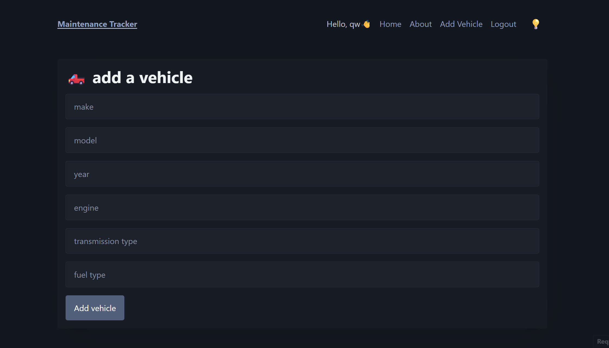

---

## displaying of vehicle infomation 
When viewing the website i have made i was looking at the home page where the vehicles the currently logged in user has are displayed, i want to make sure that all of the data allocated to the vehicles is present in the home page so the user can have a quick look at some infomation about the vehicle being displayed.
**PLACE SCREENSHOTS AND/OR ANIMATED GIFS OF THE TESTING HERE**
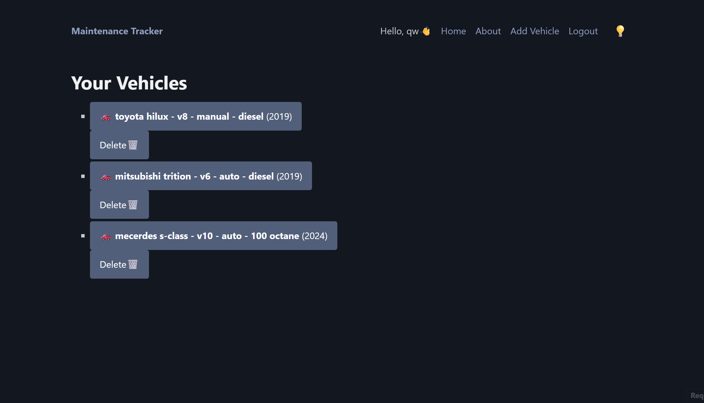
### Changes / Improvements
the image above shows the current vehicles that the user has, it displays the infomation well and what i was going for. although sometimes if the user didnt enter all of the infomation about the vehicle that was needed it wouldnt display anything.
**PLACE SCREENSHOTS AND/OR ANIMATED GIFS OF THE IMPROVED SYSTEM HERE**

---

## continuation of emojis 
I addded some emojis to some of the main headings and texts in the home page and the vehicle log displaying page. I left out many of the other major pages such as the about page, add vehicle page, login page and the register page.
**PLACE SCREENSHOTS AND/OR ANIMATED GIFS OF THE TESTING HERE**
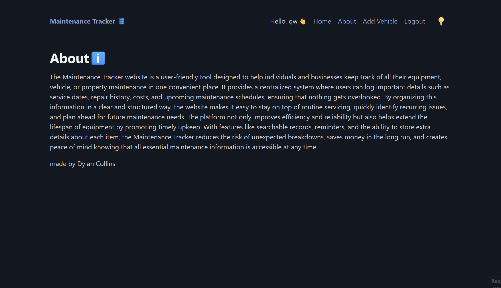 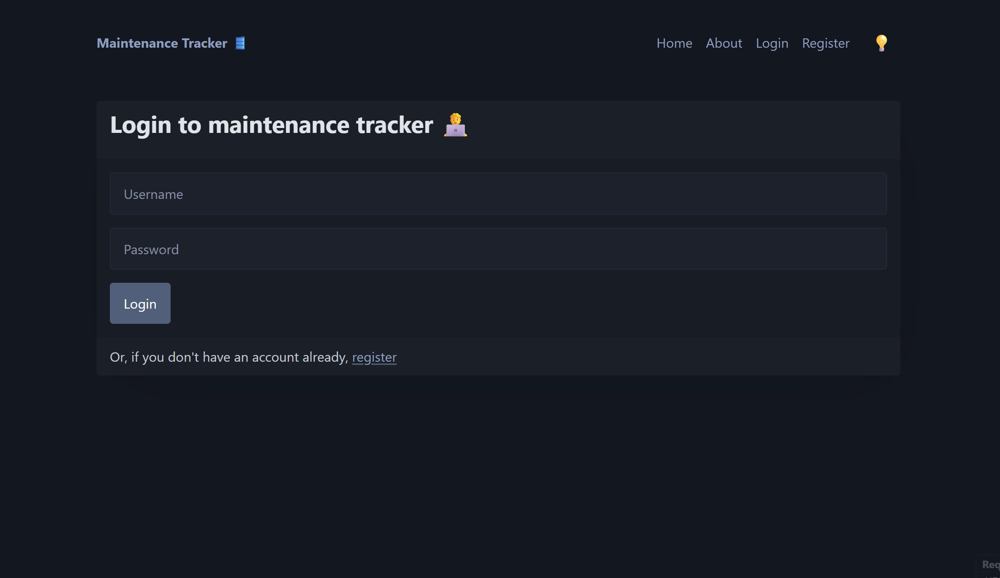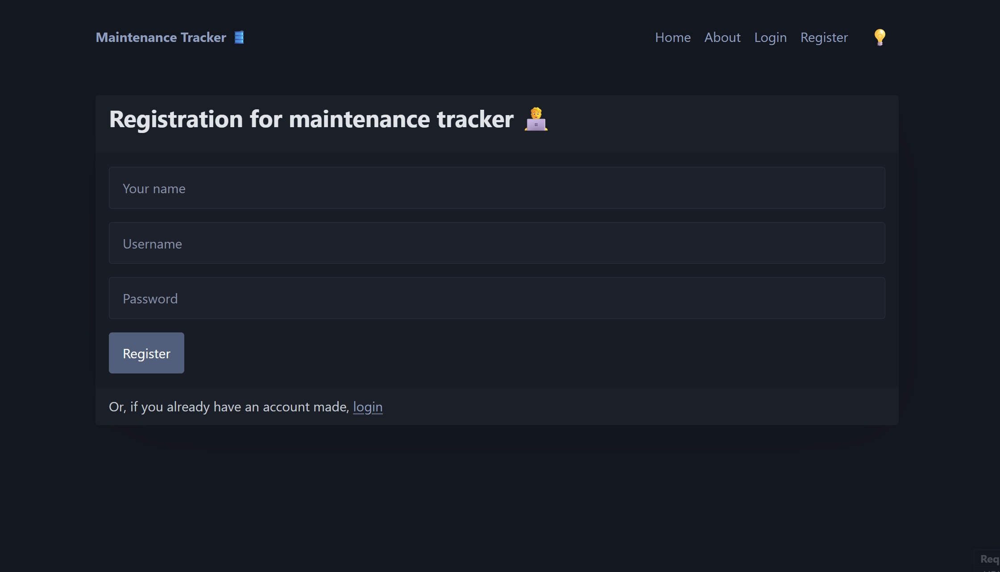
### Changes / Improvements
I added more emojis to the pages above. this allowed for a more friendly and useable user experience when coasting around the website. As bright and colourful emojis make the user feel more safe and secure and can also make it signficantly easier for the user to nagitiave the page and emojis also have a meaning behind them of what the page is about, which gives users a hint about what the page is about if they dont already know.
**PLACE SCREENSHOTS AND/OR ANIMATED GIFS OF THE IMPROVED SYSTEM HERE**
  

---

## downloading of current logs user has 

Replace this text with notes about what you are testing, how you tested it, and the outcome of the testing
When refining the mainteance tracker website one of the problems that i realized that it didnt have was the ability to download all of the current logs the user has from there vehicles in a csv text file. this would allow the user to dowload current logs from their vehicles for safe keeping
**PLACE SCREENSHOTS AND/OR ANIMATED GIFS OF THE TESTING HERE**
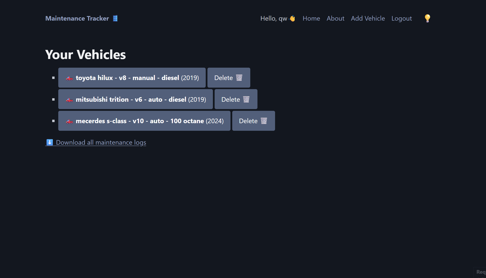
### Changes / Improvements

Replace this text with notes any improvements you made as a result of the testing.
When testing this system i had problems with using the right app to open the text based csv file of the logs the user has currently stored on thier vehicles that they own. After some trail and error i managed to figure out that mircosoft excel worked and could display the csv file of the users logs from their vehicle 
**PLACE SCREENSHOTS AND/OR ANIMATED GIFS OF THE IMPROVED SYSTEM HERE**

---

## Sprint Review

Replace this text with a statement about how the sprint has moved the project forward - key success point, any things that didn't go so well, etc.
Overall this sprint went quite well, i managed to get lots of the refinements that the website needed to get completed which has changed the user experience of the website compelety
