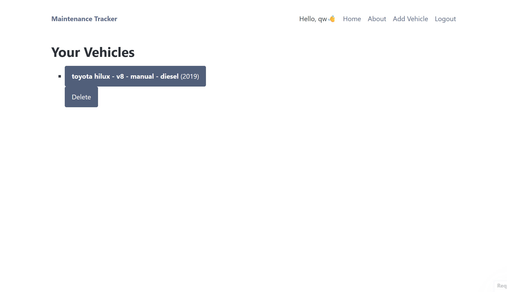
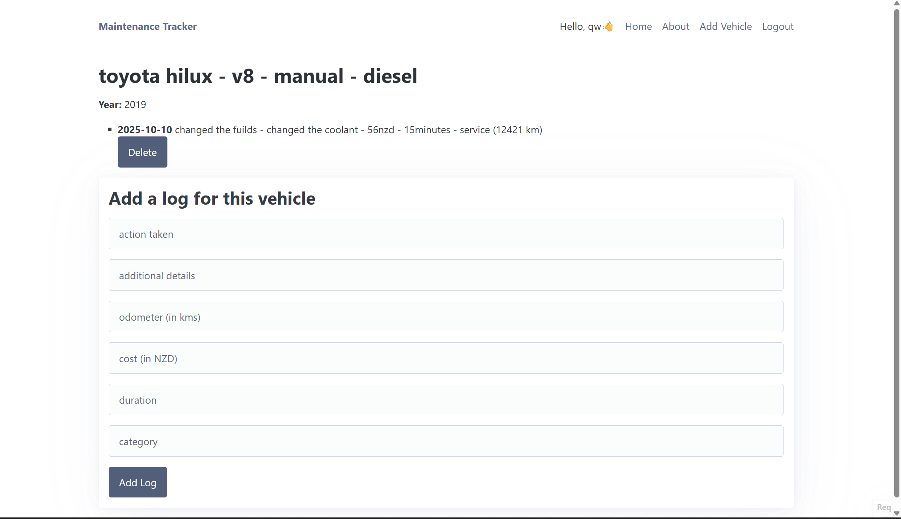
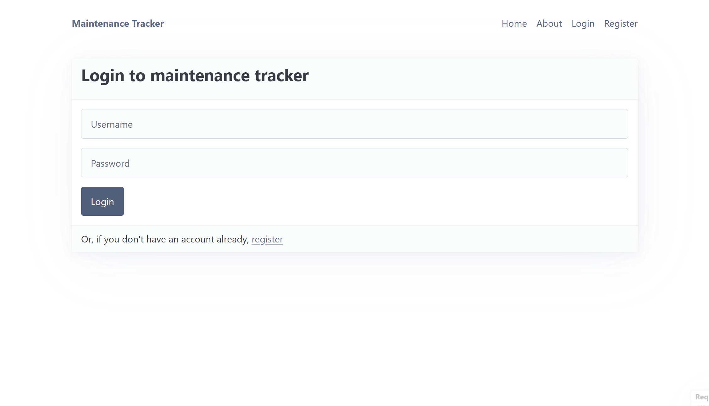
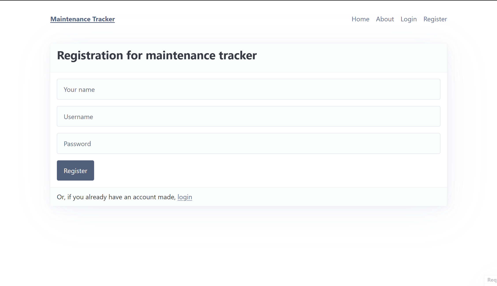

# Sprint 3 - A Refined and Complete System

## Sprint Goals

Develop the system until it is fully featured, with a refined UI and it satisfies the requirements. The system will be fully tested at this point.

---

## Updated Database Schema (if it changed)

the DB schema has changed quite a bit considering the image shown below, i have added other data such as, engine, transmission, duration, service type and many others. signficant changes have been made to the database schema

---

## Final Implementation

The web app is fully implemented with a refined UI:

**PLACE SCREENSHOTS AND/OR ANIMATED GIFS OF THE SYSTEM HERE**
home page:
,
log add and view page:
, 
about page:

add vehicle page:
, 
login page:
, 
registration page:
, 

---

## light and dark mode

when i was testing the website for core functions that make the website useable and appeling to the user i though about the addition of a dark mode, this would allow the user to switch between dark and light mode whenever they want. this would improve the user experience but allowing the user to change the brightness of the website via light and dark mode
**PLACE SCREENSHOTS AND/OR ANIMATED GIFS OF THE TESTING HERE**
 
### Changes / Improvements
the screenshots above was the icon being inplemeted but it wouldnt allow me to change through the dark and light mode i would have to reload the website, now with the improvements and changes i have made it now allows the user to change between light and dark mode without having to reload the wesbite, which allows for a overall better user experience. 
**PLACE SCREENSHOTS AND/OR ANIMATED GIFS OF THE IMPROVED SYSTEM HERE**
<video controls src="Vehicle List - Google Chrome 2025-10-21 09-54-31.mp4" title="Title"></video>

---

## emojis for different titles
when my end users were giving me feedback on what could improve the user experience of the website they said that i could add emojis around some of the titles of the website i currently have, for example the vehicle description and log descriptions.
**PLACE SCREENSHOTS AND/OR ANIMATED GIFS OF THE TESTING HERE**
 

### Changes / Improvements

I added some more across more of the pages to further inprove the ability of the user scanning throughout the website to identify areas throughout the website where it could be harder made easier with the addition of these emojis.
**PLACE SCREENSHOTS AND/OR ANIMATED GIFS OF THE IMPROVED SYSTEM HERE**

---

## Testing FEATURE NAME HERE

Replace this text with notes about what you are testing, how you tested it, and the outcome of the testing

**PLACE SCREENSHOTS AND/OR ANIMATED GIFS OF THE TESTING HERE**

### Changes / Improvements

Replace this text with notes any improvements you made as a result of the testing.

**PLACE SCREENSHOTS AND/OR ANIMATED GIFS OF THE IMPROVED SYSTEM HERE**

---

## Testing FEATURE NAME HERE

Replace this text with notes about what you are testing, how you tested it, and the outcome of the testing

**PLACE SCREENSHOTS AND/OR ANIMATED GIFS OF THE TESTING HERE**

### Changes / Improvements

Replace this text with notes any improvements you made as a result of the testing.

**PLACE SCREENSHOTS AND/OR ANIMATED GIFS OF THE IMPROVED SYSTEM HERE**

---

## Testing FEATURE NAME HERE

Replace this text with notes about what you are testing, how you tested it, and the outcome of the testing

**PLACE SCREENSHOTS AND/OR ANIMATED GIFS OF THE TESTING HERE**

### Changes / Improvements

Replace this text with notes any improvements you made as a result of the testing.

**PLACE SCREENSHOTS AND/OR ANIMATED GIFS OF THE IMPROVED SYSTEM HERE**

---

## Sprint Review

Replace this text with a statement about how the sprint has moved the project forward - key success point, any things that didn't go so well, etc.

